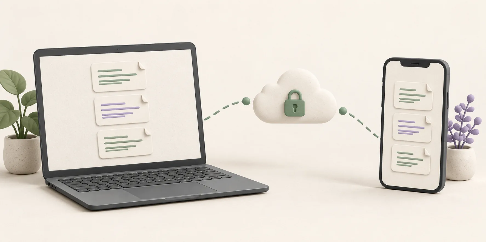
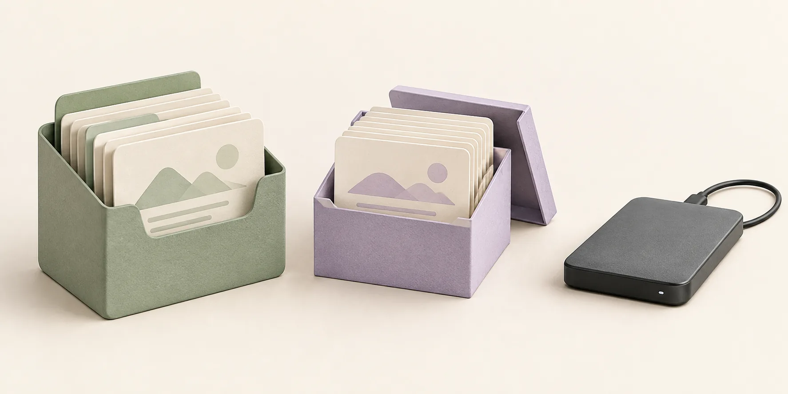
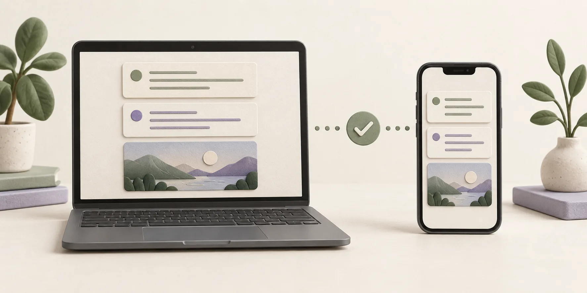

想在 Windows 電腦寫 Obsidian 筆記，出門後繼續用 iPhone 查看或修改？重點是選一種**兩台裝置上的 Obsidian 都能使用的同步方式**。想用官方功能，Obsidian Sync 最容易上手；想用端對端加密的社群外掛，可以考慮 Synch。其他外掛與 Git 也辦得到，只是要多花點時間設定。

你可能會想：把 vault 放進 Windows 上的 iCloud Drive，不就能在 iPhone 開啟了嗎？但 Obsidian 在[官方同步指南](https://obsidian.md/help/sync-notes)提醒，Windows 版 iCloud Drive 可能造成檔案重複或損毀。如果只在 Mac、iPhone 等 Apple 裝置之間同步，iCloud 會比較合適。

下面先比較幾種做法，再說明如何移轉現有 vault，以及怎麼確認第一次同步真的完成。

## 應該選擇哪種方法？

| 方法 | 適合的情況 | 需要知道的事 |
| --- | --- | --- |
| **Obsidian Sync** | 想用官方功能，快速連接兩台裝置 | 需要付費訂閱；建立遠端 vault 時可選擇端對端加密 |
| **Synch** | 想找有小型 vault 免費方案的加密同步服務 | 兩台裝置的 Obsidian 都需安裝 Synchrun 社群外掛 |
| **Remotely Save** | 已使用支援的儲存服務，並願意自行設定 | 設定及運作方式取決於儲存服務與外掛設定 |
| **Git 搭配 iOS Git 應用程式** | 熟悉 Git，想手動管理版本 | 需要自行拉取、提交、推送及解決衝突 |

如果你常在 Windows 電腦與 iPhone 之間切換，可以先看看 Obsidian Sync 和 Synch。它們都透過遠端 vault 連接兩邊的本機 vault，不用想辦法在 iPhone 上把 Windows 雲端硬碟資料夾硬當成 Obsidian vault 開啟。

Google Drive 與 OneDrive 很方便在 Windows 上管理檔案，但都沒有提供簡單、受官方支援的 iOS Obsidian vault 資料夾存取方式。Syncthing 在 iOS 上也需要額外工具。決定採用這些方式前，請先查看 [Obsidian 的平台說明](https://obsidian.md/help/sync-notes)。

## 連接裝置前，先保護 vault

**先找出最新的筆記在哪台裝置上。** 如果兩邊都編輯過，連接新的遠端 vault 前，要比對最近的筆記與附件。Windows 上比較容易翻找檔案，但最新內容不一定都在那裡。

確認好最新內容後，照這個順序做：

1. 等待目前的同步服務完成尚未結束的下載。
2. 另外複製一份完整的 vault，包括附件與 `.obsidian` 資料夾。把備份放在 iCloud、OneDrive 及新同步服務管理的資料夾之外。
3. 開啟備份，檢查幾篇近期筆記與附件是否存在。
4. 設定新方法的過程中，不要修改備份。

同步不能取代備份。某台裝置誤刪筆記時，刪除也可能同步到其他裝置。即使已經使用同步服務，Obsidian 仍[建議另外備份](https://obsidian.md/help/backup)。

### 如果目前在 Windows 上透過 iCloud 同步 vault

備份好之後，在 Windows 上**把 vault 複製到 iCloud Drive 以外的本機資料夾**，再用 Obsidian 開啟這份新副本。用它開始新的同步。iPhone 這邊也建立新的本機 vault，不要直接替原本走 iCloud 的 vault 再接一套同步服務。

確認新方式可用前，可保留舊 iCloud 副本供查閱。但不要繼續編輯兩份副本，否則筆記會形成彼此不同的版本。Obsidian 明確提醒使用者[不要在同一個 vault 上混用同步服務](https://obsidian.md/help/sync-notes)。

如果 iPhone 上有 Windows 裡沒有的新內容，請在**首次上傳前**把它們補進新副本。同一篇筆記在兩台裝置上的內容不同時，先比對內容，再決定保留哪些修改。

## 方法一：設定 Obsidian Sync

[Obsidian Sync](https://obsidian.md/sync) 內建於 Obsidian，支援 Windows 與 iOS。你需要 Obsidian 帳號及 Sync 訂閱。

在 Windows 上：

1. 開啟完整的本機工作 vault。如果它仍在 iCloud Drive 中，請先改用上文提到的獨立本機副本。
2. 在 **Settings → General → Account** 登入，並啟用 **Sync** 核心外掛。
3. 開啟 **Settings → Sync**，建立遠端 vault。如果要使用端對端加密，請設定加密密碼。它與帳號密碼不同，應妥善保存。
4. 檢查選擇性同步及 vault 設定同步選項，再開始同步。等待 Obsidian 顯示 **Fully Synced**。

在 iPhone 上：

1. 開啟 Obsidian 的 vault 切換畫面，選擇 **Setup Obsidian Sync**。從剛上傳的遠端 vault 建立新的本機 vault。
2. 登入並選擇遠端 vault；如有提示，輸入加密密碼。
3. 檢查 iPhone 的同步設定，等首次下載完成後再開始編輯。

Obsidian 的[設定指南](https://obsidian.md/help/sync/setup)提供目前介面的操作步驟、狀態圖示及設定同步選項。在 iPhone 使用新的本機 vault，可以避免新上傳的資料與舊 iCloud 副本合併。

## 方法二：設定 Synch

Synch 透過桌面版與行動版 Obsidian 的 **Synchrun** 社群外掛運作。vault 資料在裝置上加密後才會上傳。它提供託管方案，其中包括適合小型 vault 的免費方案。如果 vault 有大型附件，請查看[目前方案](https://synch.run/zh-tw/pricing)的限制。

在 Windows 上：

1. 開啟位於其他同步服務管理資料夾之外、內容完整的本機工作 vault。
2. 在 **Settings → Community plugins** 搜尋 **Synchrun**，安裝並啟用。
3. 開啟外掛設定，登入後選擇 **Create vault**。
4. 設定並妥善保存 vault 密碼。保持 Obsidian 開啟，等待首次上傳完成。

在 iPhone 上：

1. 在 Obsidian 建立新的空白本機 vault。不要用原本由 iCloud 管理的副本進行這次連接。
2. 從社群外掛中安裝並啟用 **Synchrun**，使用同一個帳號登入。
3. 選擇 **Connect vault**，選取遠端 vault，然後輸入 vault 密碼。
4. 保持 Obsidian 開啟，直到首次下載完成。開始新編輯前，先檢查近期筆記與附件。

[Synch 專案說明](https://github.com/hjinco/synch#get-started)列出目前的外掛安裝步驟。vault 密碼用於在其他裝置解鎖加密資料，請妥善保存。詳情請參閱 [Synch 如何加密及解鎖 vault](/zh-tw/blog/encryption-and-decryption/)。

## 第一次同步，兩個方向都要試

成功登入不代表檔案都同步好了。用幾篇筆記實際測試：

1. 在 iPhone 開啟兩篇原本位於 Windows 的近期筆記和一個附件。
2. 在 Windows 建立一篇簡短的測試筆記。等待同步完成，確認它出現在 iPhone。
3. 在 iPhone 建立另一篇測試筆記。保持 Obsidian 開啟直到同步完成，再確認它出現在 Windows。
4. 比對兩篇測試筆記的內容，而不只看檔名。
5. 尋找重複檔案或衝突檔案；如果找到，先檢查內容再刪除。

如果同步 `.obsidian` 資料夾，請確認需要的外掛與設定能在 iPhone 正常運作。桌面版與行動版可能需要不同的版面或外掛行為。等筆記與附件穩定同步後，再決定要共享哪些設定也不遲。

## 還能考慮哪些方法？

**Remotely Save** 可以把兩台裝置的 Obsidian 連接到自行選擇的儲存服務。它讓你更自由地選擇儲存位置，但需要自行確認服務的相容性、加密設定及衝突處理方式。我們的 [Remotely Save 指南](/zh-tw/blog/obsidian-remotely-save/)介紹這些取捨。

如果你已熟悉拉取和推送變更，**Git** 也是一種選擇。iPhone 上需要 Working Copy 等 Git 應用程式，以及額外的手動步驟。它適合刻意管理版本，但不太適合在手機上快速記筆記。請參閱我們的 [Obsidian Git 指南](/zh-tw/blog/obsidian-git-sync/)。

**不要讓兩套同步工具同時管理同一個 vault。** 在別處放一份備份沒有問題，但兩個服務同時修改工作資料夾，就可能發生衝突。如果筆記重複或看起來不見了，先別繼續編輯。檢查兩台裝置上的檔案與備份，再參閱我們的[同步衝突指南](/zh-tw/blog/obsidian-sync-conflicts/)。

## Windows 與 iPhone 同步常見問題

### 可以免費在 Windows 和 iPhone 之間同步 Obsidian 嗎？

可以，取決於 vault 大小，以及你願意處理多少設定工作。Synch 有適合小型 vault 的免費方案。社群外掛或 Git 也可能利用你已在使用的服務，但儲存空間或應用程式功能可能另有限制。Obsidian Sync 是付費服務。移轉大型 vault 前，請確認目前方案的限制。

### 可以用 iCloud 在 Windows 和 iPhone 之間同步 Obsidian 嗎？

你或許能在 Windows 開啟 iCloud Drive 資料夾，但 Obsidian [警告 Windows 版 iCloud Drive 可能造成檔案重複或損毀](https://obsidian.md/help/sync-notes)。如果 vault 需要在兩台裝置上編輯，請使用能連接 Windows 與 iOS 的方式，並保留獨立備份。

### 為什麼 iPhone 上的筆記沒有出現在 Windows？

先確認兩台裝置連接的是**同一個遠端 vault**，而且第一次同步已經結束。在 iPhone 上，Obsidian 要保持開啟，直到變更上傳完成。如果那篇筆記只在舊 iCloud vault 裡，新建的 vault 不會自動把它帶過來。處理舊副本前，先找到並複製該筆記。

### 應該同步 `.obsidian` 資料夾嗎？

其中保存外掛、主題與工作區等設定。同步部分設定能讓兩台裝置的環境更一致，但桌面設定不一定適合手機。先確認筆記和附件能正確同步，再選擇兩台裝置都需要的設定檔案。

## 從哪裡開始比較好？

如果現在才開始設定，想用官方功能可以選 **Obsidian Sync**；想透過社群外掛使用端對端加密服務，可以考慮 **Synch**。先確認 vault 裡的檔案都到齊，另外留一份備份。讓 iPhone 連接新的本機 vault，親自試過雙向同步後，再把它當作日常使用的 vault。
