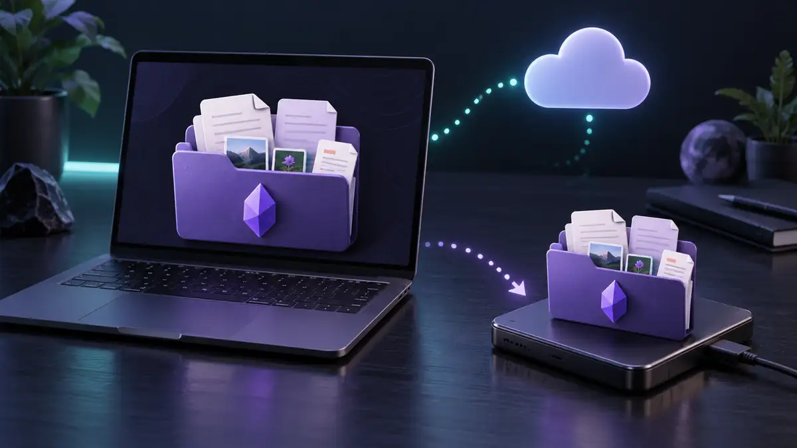
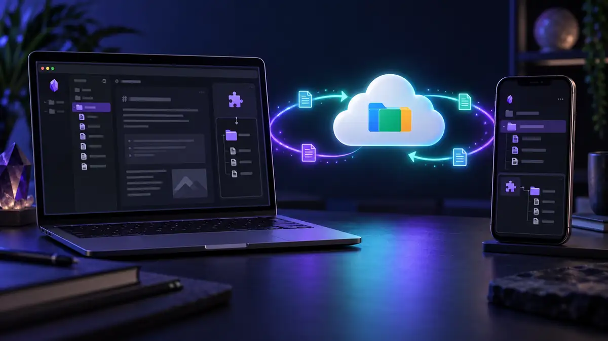

You can **sync Obsidian with Google Drive**, but the setup depends on your devices. On Windows and Mac, you can keep a vault in a folder managed by Google Drive for desktop. Android needs an additional way to keep that folder available locally. On iPhone and iPad, the Google Drive app alone does not give Obsidian a supported vault folder.

An Obsidian community plugin offers another route: it connects to Google Drive from inside Obsidian, including on iOS. That is a different sync method from putting your vault in a Google Drive desktop folder. Choose one method for each active vault; do not run both against the same files.

This guide explains what works on each device, how to start without losing notes, and when Google Drive is more trouble than it is worth.

## Can Obsidian sync directly with Google Drive?

Obsidian stores a vault as local files. Google Drive can move copies of those files between devices, but it does not become Obsidian's built-in sync service. Obsidian's [sync guide](https://obsidian.md/help/sync-notes) lists Google Drive as a third-party option for Windows, Mac, and Android, with limited iOS support. It also notes that third-party apps or plugins may be needed.

The distinction matters because three setups often get called “Google Drive sync”:

| Setup | Where Obsidian reads the vault | Best fit |
| --- | --- | --- |
| Google Drive for desktop | A local folder managed by Drive | Windows and Mac |
| Drive plus an Android folder-sync app | A local Android folder copied to and from Drive | Desktop and Android, if you are comfortable managing another app |
| An Obsidian Google Drive plugin | A local vault synced through the plugin | People who want one plugin workflow across desktop and mobile, including iOS |

Having the Google Drive app installed on a phone does **not** mean Obsidian can open its cloud files as a working local vault. Check the full route from one device's local vault to the other device's local vault before choosing a setup.

## Before you change your sync setup

If you already have a vault, protect it before moving folders or enabling a plugin:

1. Let your current sync service finish uploading and downloading.
2. Make a separate copy of the complete vault, including attachments and the `.obsidian` settings folder. Keep it outside the folder your sync service manages.
3. Open the copy and check a few recent notes and attachments.
4. Decide which device has the most complete version before connecting another device.

Keep that backup untouched until you have tested the new setup in both directions. [Obsidian's backup guide](https://obsidian.md/help/backup) explains why a synced copy is not a backup: a mistaken deletion can also sync.

If the same vault is already synced through iCloud, OneDrive, Obsidian Sync, or another plugin, move to a separate working copy before changing methods. Obsidian [warns against mixing sync services on one vault](https://obsidian.md/help/sync-notes).

## Option 1: Use a Google Drive folder on Windows or Mac

For a desktop-only setup, this is the simplest Google Drive route:

1. Install and sign in to **Google Drive for desktop** on each computer.
2. Create a vault folder in Google Drive, or move a backed-up vault there.
3. Make the vault files **available offline** so Obsidian can read them as local files even when Drive is not connected.
4. Open that folder as a vault in Obsidian on the first computer.
5. Wait for Drive to finish syncing before opening the folder as a vault on the second computer.
6. Create a test note on one computer, wait for Drive to finish, and confirm its contents on the other.

These steps follow [Obsidian's Google Drive guidance](https://obsidian.md/help/sync-notes). On both computers, wait for changes to arrive before editing the same note. A desktop folder setup also needs a separate backup; Drive will copy deletions and bad edits as readily as good ones.

### What about Android?

Android Obsidian needs a **local vault folder**. Signing in to the Google Drive app does not by itself keep a two-way local folder in sync for Obsidian. A third-party Android folder-sync app can bridge that gap: it copies the Google Drive vault to a local Android folder that Obsidian can open.

If you choose this route, follow the folder-sync app's current setup instructions and test it with a small vault first. Confirm that edits made on Android upload to Drive and edits made on desktop download to Android. Check how the app handles deletions and conflicting edits before trusting it with your main vault. Our [Windows and Android sync guide](/blog/how-to-sync-obsidian-windows-android/) compares this approach with other options.

### What about iPhone and iPad?

Obsidian's [platform guidance](https://obsidian.md/help/sync-notes) says Google Drive is **not officially supported for syncing Obsidian vaults on iOS**. Seeing files in the Google Drive or Files app is not the same as having a supported, automatically synced Obsidian vault.

If iPhone or iPad is part of your setup, use a plugin that explicitly supports iOS or choose a sync method built to work across those devices. See the [Windows and iPhone guide](/blog/how-to-sync-obsidian-windows-iphone/) if that is your device pair.

## Option 2: Use an Obsidian plugin that connects to Google Drive

The community [Google Drive Sync plugin](https://community.obsidian.md/plugins/google-drive-sync) connects to Google Drive through Obsidian rather than relying on a desktop Drive folder. Its documentation lists desktop and mobile support, including the Obsidian iOS app.

This route has its own setup and rules. The plugin asks you to authorize Google Drive and add a refresh token to its settings. Its documentation says a pull runs when the vault opens; uploading local changes requires a push unless you enable automatic pushing. The plugin also advises you to back up first, avoid editing the same note on two devices at once, and sync before switching devices.

**Do not combine this plugin with Drive for desktop or another Google Drive sync tool on the same vault.** The plugin's documentation warns that files added by other methods may not be tracked correctly and could cause data loss. If you have an existing vault, read its [new-device and migration instructions](https://community.obsidian.md/plugins/google-drive-sync) before enabling it; do not point it at two populated copies and assume it will merge them safely.

For a fresh setup:

1. Back up the vault, then read the plugin's current setup and new-device instructions.
2. Install and enable the plugin in Obsidian on the first device, then complete its Google authorization steps.
3. Add your vault content using the plugin's documented workflow and finish the first upload.
4. Set up the second device using the plugin's new-device instructions. Let its initial download finish before editing.
5. Create a test note on each device and confirm that both notes and an attachment arrive on the other device.

The plugin describes how it handles authorization tokens and an intermediary service on its [plugin page](https://community.obsidian.md/plugins/google-drive-sync). Read that section before granting access, especially if privacy is the reason you are choosing a sync method.

**Remotely Save** is another community plugin with Google Drive support, but its [Google Drive connection is a paid PRO feature](https://github.com/remotely-save/remotely-save/blob/master/docs/remote_services/googledrive/README.md). It can be a good fit if you already use Remotely Save and want to keep its workflow. Our [Remotely Save guide](/blog/obsidian-remotely-save/) covers its tradeoffs in more detail.

## Common Google Drive sync problems

### Notes appear on desktop but not on my phone

Check whether your phone has a **local Obsidian vault** connected to a working sync method. The Google Drive app displaying a note is not proof that Obsidian can open or update it. If you use a plugin, check its sync status and whether the first download completed. If you use an Android folder-sync app, check the local folder it is configured to update.

### I see duplicate or conflicting notes

Stop editing on both devices. Check each local copy and your separate backup before deleting a file. Conflicts often follow overlapping edits, incomplete uploads, or two sync tools managing the same vault. Our [sync conflict guide](/blog/obsidian-sync-conflicts/) walks through those cases.

### Is a Google Drive vault end-to-end encrypted?

Putting a vault folder in Google Drive does not, by itself, add vault-level end-to-end encryption. If that is a requirement, evaluate the encryption behavior of the specific plugin or sync service you choose. Do not assume every Google Drive plugin protects file contents in the same way.

## Choosing a setup you can live with

Google Drive is reasonable for a desktop vault when you already use Drive and can wait for files to finish syncing before switching computers. It can also work on Android or iOS with extra software, provided you understand that software's setup and conflict behavior. For every route, keep an independent backup and test a change in both directions.

If your real goal is to open the same private Obsidian vault across desktop and mobile **without managing a Google Drive folder, a phone folder-sync app, or Drive API credentials**, [Synch](https://synch.run/) is another option. Its Synchrun community plugin syncs the vault inside Obsidian and encrypts vault data on your device before upload. You can start with its [free plan](https://synch.run/pricing) if your vault fits the current limits. Google Drive remains useful for general file storage; Synch is designed specifically for the Obsidian sync workflow.
