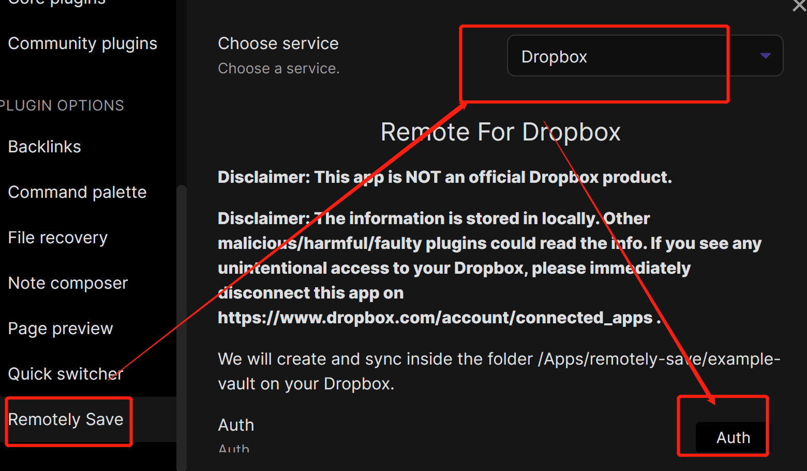
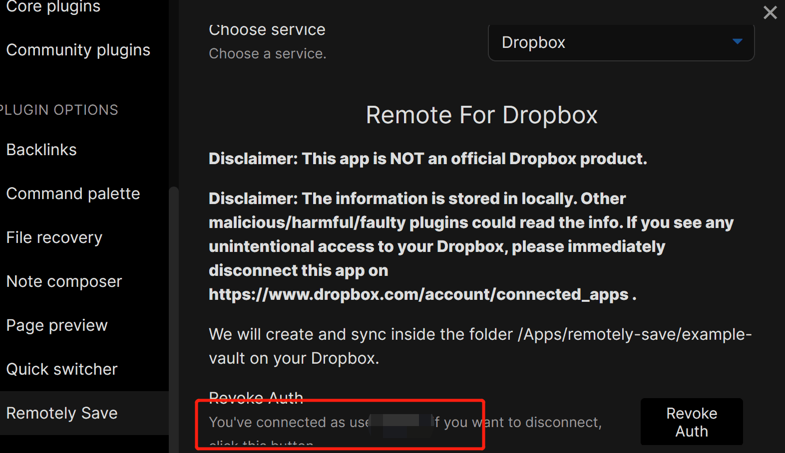
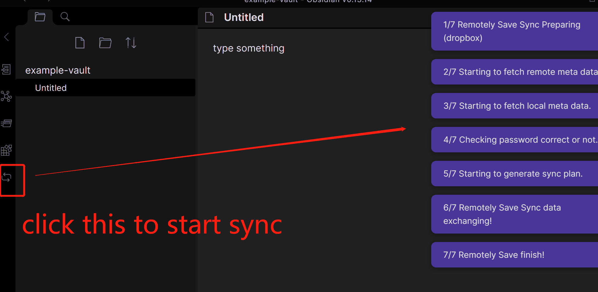

**Remotely Save 可以通过你选择的云存储同步 Obsidian 仓库。** 在电脑和手机上分别安装插件，连接同一个存储账号和远程仓库，再依次完成同步，就能在设备间接着编辑笔记。

本文以 Dropbox 为例，从首次连接讲到第二台设备下载笔记，再验证修改能否传回第一台设备。如果已经配好了但笔记迟迟不出现，可以直接查看后面的故障排查表。

Remotely Save 是社区插件，不属于官方 Obsidian Sync 服务。你需要自行管理存储空间、访问权限和数据恢复方式。

## 哪些存储服务可以免费连接？

插件有免费连接功能，也有付费的 PRO 功能。连接功能免费，不代表存储服务本身免费；容量、流量或 API 调用仍可能产生费用。

| 存储服务 | 插件功能 | 使用前要确认的事项 |
| --- | --- | --- |
| Dropbox | 免费 | 剩余容量，以及所有设备要使用的账号 |
| S3 兼容存储 | 免费 | 存储桶、端点、密钥、存储和 API 费用 |
| WebDAV | 免费 | 服务器地址、认证方式和兼容性 |
| 个人版 OneDrive，App Folder | 免费 | 使用应用专用文件夹，而非任意现有文件夹 |
| 个人版 OneDrive，Full | PRO | 访问应用文件夹以外的位置时需要 |
| Google Drive | PRO | 需启用对应功能并完成授权 |
| Box、pCloud、Yandex Disk、Koofr、Azure Blob | PRO | 对应连接功能及存储服务自身的限制 |

选定之前，请核对项目的[支持服务列表](https://github.com/remotely-save/remotely-save/blob/master/docs/services_connectable_or_not.md)。如果还在考虑其他方法，可以阅读[免费同步 Obsidian 的方案对比](/zh-cn/blog/free-obsidian-sync/)。

## 用 Dropbox 完成第一次同步

下面的步骤适用于**新建同步配置**。如果两台设备上已经有各自修改过的仓库，请先分别保留副本，不要让第一次同步替你决定保留哪一份。

### 1. 先备份，再准备测试笔记

从笔记最完整的设备开始。将整个仓库复制到同步目录之外，并确认备份能够正常打开。

一个正在使用的仓库只交给一种同步工具管理。Remotely Save 会直接连接 Dropbox，因此不要同时把仓库放进 Dropbox 桌面客户端的同步目录，造成重复同步。

初次尝试时，建议创建一个小型测试仓库，例如 `Notes-Sync-Test`。名称不要与同一 Dropbox 账号中已有的远程仓库重复。新建一篇“同步测试”笔记，写一句在手机上容易辨认的话。

### 2. 安装并启用 Remotely Save

进入 Obsidian 的**设置 → 第三方插件**，按提示允许使用社区插件，然后在插件列表中搜索 **Remotely Save**，安装并启用。先打开插件设置，再进行同步。

下方截图使用的是旧版 Obsidian，当前版本的布局和选项名称可能不同。

### 3. 授权 Dropbox 账号

在 Remotely Save 设置的 **Choose service** 中选择 **Dropbox**，点击 **Auth**。在浏览器中打开插件给出的链接，确认登录的是准备使用的 Dropbox 账号，再允许连接。返回 Obsidian 后，检查插件是否已显示连接成功。

*先选 Dropbox，再点击 Auth。*

文档说明，文件保存在 Dropbox 的 `/Apps/remotely-save` 下。默认配置通过仓库名称区分同步目标，因此其他设备也要使用相同的仓库名称。访问范围详见 [Dropbox 连接说明](https://github.com/remotely-save/remotely-save#dropbox)。

*这个界面中，连接后 Auth 会变为 Revoke Auth。账号连好后，还要运行同步才能传输笔记。*

### 4. 需要加密的话，在首次上传前设置

如果希望使用端到端加密，请先设置好再上传。将密码保存在密码管理器中，并记下所选的加密格式。所有设备都必须使用一致的格式和密码。

项目文档介绍了 [Rclone Crypt 和 OpenSSL 两种格式](https://github.com/remotely-save/remotely-save/blob/master/docs/encryption/README.md)。加密是可选项，连接存储账号并不会自动开启。Dropbox 连接说明还指出，仓库名称本身不会被加密。

不要为了排查问题，随意更改正在使用的远程仓库的加密密码或格式。先保留可读的本地副本，再按加密文档处理已有配置。

### 5. 手动运行首次同步

点击 Obsidian 侧边工具栏中的 Remotely Save 同步图标，或通过命令面板执行其同步命令。保持 Obsidian 打开，等待完成。如果出现错误，先解决问题，再连接第二台设备。

*点击标出的同步按钮，等到完成后再切换设备。*

测试期间先关闭定时同步，手动控制每一次操作。也要检查文件大小限制和路径排除规则：同步成功不等于所有附件都已传输，被排除的文件可能根本没有参与同步。

### 6. 连接手机或另一台电脑

1. 创建一个**名称相同**的空白本地仓库。iPhone 或 iPad 上请关闭该仓库的 **Store in iCloud** 选项。
2. 在这个仓库中安装并启用 Remotely Save。
3. 选择 Dropbox，授权同一个账号。
4. 如果启用了加密，填入与第一台设备一致的格式和密码。若自定义了远程位置，也要保持一致。
5. 手动执行同步，保持应用打开直到完成。
6. 打开“同步测试”，确认第一台设备写下的那句话已经出现。

从空白仓库开始，是为了避免一开始就混合两份独立修改的内容。第一台设备的备份仍需保留。

### 7. 再验证一次反向同步

在第二台设备的“同步测试”中添加一句话，完成同步。接着在第一台设备上同步，检查新内容是否出现。如果平时经常使用附件，也用一个小文件测试一下。

确认双向同步正常后，再开启定时同步并开始日常使用。换设备时，先同步刚用完的设备，再同步准备使用的设备，最后开始编辑。

## 手机同步时，尽量保持 Obsidian 在前台

Remotely Save 支持移动版 Obsidian，但应按**打开应用后再同步**的方式使用。即使设置了定时同步，也不能保证操作系统挂起应用后，插件还会继续运行。

首次下载要给附件留出时间。如果中途被打断，请重新打开 Obsidian，检查错误信息和文件是否到齐，再继续编辑。

项目的[限制说明](https://github.com/remotely-save/remotely-save#limitations)提到了移动端处理大文件的性能问题，包括 50 MB 及以上的文件。若笔记正常、PDF 或录音却没有同步，先检查大文件排除设置。其他跨平台方案可参考 [iPhone 与 Android 同步 Obsidian 的方法](/zh-cn/blog/obsidian-iphone-android-sync/)。

## 同步失败或笔记不见了，先查这些

用一篇小型测试笔记，在两台设备上依次手动同步。记下失败的设备和完整错误信息，先判断是上传失败、下载失败，还是个别文件被排除了。

| 现象 | 检查什么 | 接下来怎么做 |
| --- | --- | --- |
| 授权无法完成 | 浏览器账号、是否返回 Obsidian | 重新走授权流程，确认已连接后再同步 |
| 提示完成，但另一台设备还是空的 | 账号、仓库名称、自定义远程位置 | 对比两端设置，确认第一台设备已上传 |
| 无法读取加密文件 | 密码和加密格式 | 保留可读副本，再核对原有设置 |
| 笔记到了，附件没到 | 大小限制、排除路径 | 检查缺失文件的条件及报错 |
| 手机打开应用才更新 | 应用是否被挂起、同步时机 | 编辑前后打开应用并手动同步 |
| WebDAV 或 S3 连接失败 | 地址、密钥、权限、错误信息 | 对照所用服务的配置文档检查 |
| 笔记重复或修改消失 | 多端同时编辑、其他同步工具 | 暂停其他设备上的编辑，保存所有版本后再合并 |

不要通过删除远程仓库、重装插件或删掉唯一完整的本地副本来“试试看”。文件丢失时，先保存仍然存在的本地内容，再检查备份和可用的历史记录。[同步冲突与笔记丢失指南](/zh-cn/blog/obsidian-sync-conflicts/)介绍了常见原因及恢复时的注意事项。

### Google Drive 上手动上传的文件无法同步

Google Drive 连接属于 **PRO 功能**，需要先启用对应功能，再在插件中授权。

[Google Drive 文档](https://github.com/remotely-save/remotely-save/blob/master/docs/remote_services/googledrive/README.md)还说明，插件只能访问它自己创建的文件和文件夹。通过 Drive 网页手动上传仓库，并不会让这些文件出现在插件中。请先备份本地仓库，再通过 Obsidian 中的插件上传。需要比较插件与桌面同步目录的区别，可以阅读 [Google Drive 同步指南](/zh-cn/blog/obsidian-google-drive-sync/)。

### OneDrive 账号或空文件报错

免费连接针对的是**个人版 OneDrive 的 App Folder**，不能把工作或学校账号当作同一种配置使用。访问个人版 OneDrive 的完整空间属于另一项 PRO 功能。

[OneDrive 文档](https://github.com/remotely-save/remotely-save/blob/master/docs/remote_services/onedrive/README.md)也指出，其 API 不允许上传空文件。如果空白 Markdown 笔记导致报错，可以检查插件对空文件的处理设置，或写入实际内容后重试。

## 凭据、冲突和备份也要照顾好

Remotely Save 的 `data.json` 可能包含敏感设置。不要把它提交到公开 Git 仓库，也不要放进求助截图或问题附件。分享报错时，记得移除令牌、凭据和私人笔记内容。

免费版提供基本冲突处理，高级智能冲突处理属于 PRO 功能。无论用哪一种，两台设备编辑过同一篇笔记后，都应检查两个版本。合并前保留副本，确认合并结果已正确传到另一端，再恢复编辑。

备份应放在同步目标之外。删除和误修改也可能传播到所有设备；能恢复多少，取决于实际保留下来的备份和历史记录。

## 什么时候值得换一种方案？

如果已经有偏好的存储服务，也愿意管理连接设置，Remotely Save 很合适。双向测试正常后，没有必要仅仅因为存在其他工具就迁移。

如果不想维护存储连接，可以考虑托管服务：

| 方案 | 适合的需求 | 需要考虑的事 |
| --- | --- | --- |
| Remotely Save | 自己选择 Dropbox、WebDAV、S3 等存储 | 连接、凭据、排除规则和恢复管理 |
| Obsidian Sync | 使用官方集成服务 | 付费订阅与同步范围设置 |
| Synch | 使用开源、端到端加密的托管服务 | 套餐能否容纳仓库及附件 |

[Synch](/zh-cn/)提供同步服务，无需另外连接存储账号。若还想比较设备间直接同步、自托管和 Git，可以查看 [Obsidian Sync 替代方案](/zh-cn/blog/obsidian-sync-alternatives/)。

图片来源：[Remotely Save 官方 Dropbox 文档，第 10、12、13 步](https://github.com/remotely-save/remotely-save/blob/master/docs/dropbox_review_material/README.md#steps)。
